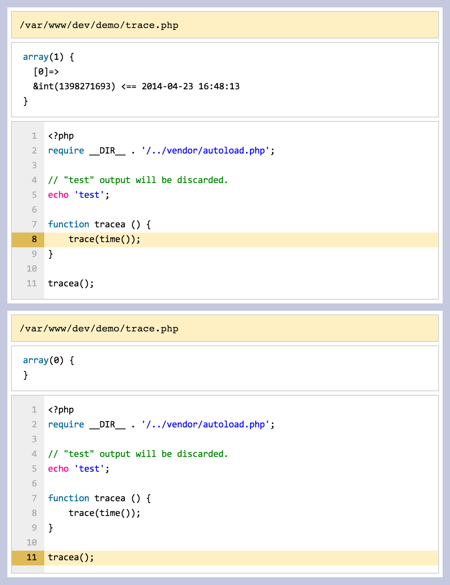

# Bugger

[](https://travis-ci.org/gajus/bugger)
[](https://coveralls.io/r/gajus/bugger?branch=master)

Bugger is a collection of functions for debugging PHP code. Use it to:

* Dump information about a variable
* Set breakpoints in loops

## API

Bugger API is exposed to the global namespace via three functions:

### Trace

```php
/**
 * Terminates the script, discards the output buffer, dumps information about the expression including backtrace up to the `trace` call.
 * 
 * @param mixed $expression The variable you want to dump.
 * @return null
 */
trace ( mixed $expression )
````

Trace is used to dump information about the expression including the backtrace information. Trace will attempt to discard existing output buffer. If output buffer cannot be discaded because it has been already sent to the browser, then Bugger will attempt to clear the previous output using client-side script.



### Stack

```php
/**
 * Stacks information about the expression and dumps the stack at the end of the script execution.
 *
 * @param mixed $expression The variable you want to dump.
 * @return null
 */
stack ( mixed $expression )
```

Stack is identical to `trace` except that calling `stack` will not terminate the script at the time of the call. If `stack` is called at least once during the script execution, then at the end of the script execution output buffer will be discarded and replaced with the collected `stack` dump, e.g.

```php
echo 'foo';
stack('a');
echo 'bar';
stack('b');
echo 'baz';
stack('c');
echo 'qux';
```

In the above example, 'foo', 'bar', 'baz' and 'qux' will be discarded.

### Tick

```php
/**
 * Tracks the number of times tick function itself has been called and returns true
 * when the desired number within the namespace is reached.
 *
 * @param int $true_after Number of the itteration after which response is true.
 * @param string $namespace Itteration namespace.
 * @return boolean
 */
tick ( int $true_after [, string $namespace = 'default' ] )
```

Tick is used to debug script loops, recursive calls, etc. Tick itself does not dump values. Tick is used to construct the statement for whatever debugging purpose, e.g.

```php
while (true) {
    if (tick(10)) {
        // Tick will return true after 10 itterations.
        break;
    }
}
```

## Installation

The recommended way to use Bugger is through Composer.

```json
{
    "require": {
       "gajus/bugger": "0.1.*"
    }
}
```

If you want to use Bugger across the server, then use [auto_prepend_file](http://uk1.php.net/manual/en/ini.core.php#ini.auto-prepend-file) setting to load `./src/autoload.php`.

## Roadmap

* Support CLI.